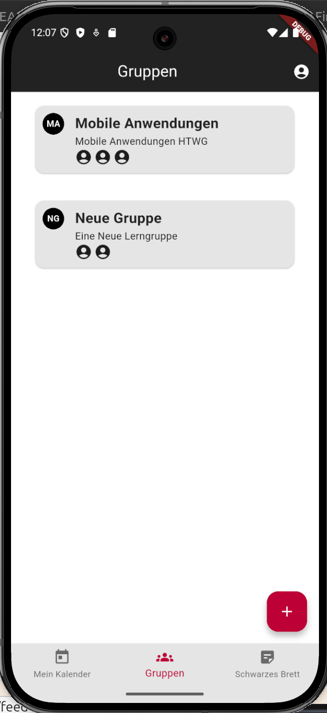
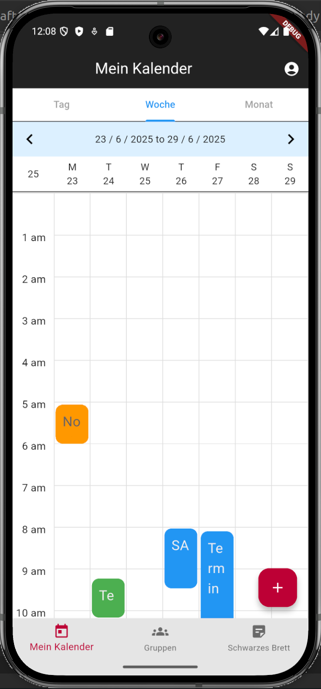
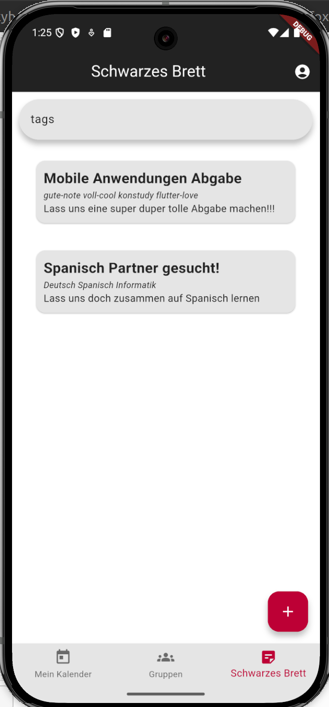
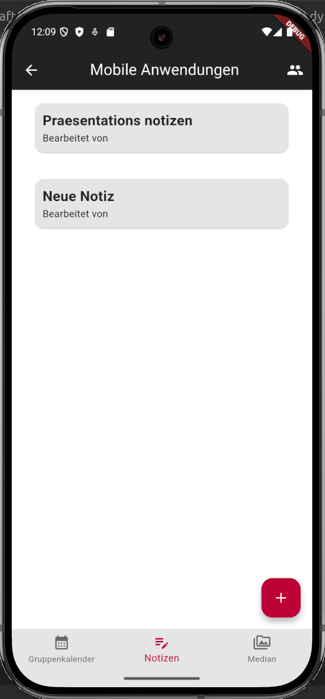
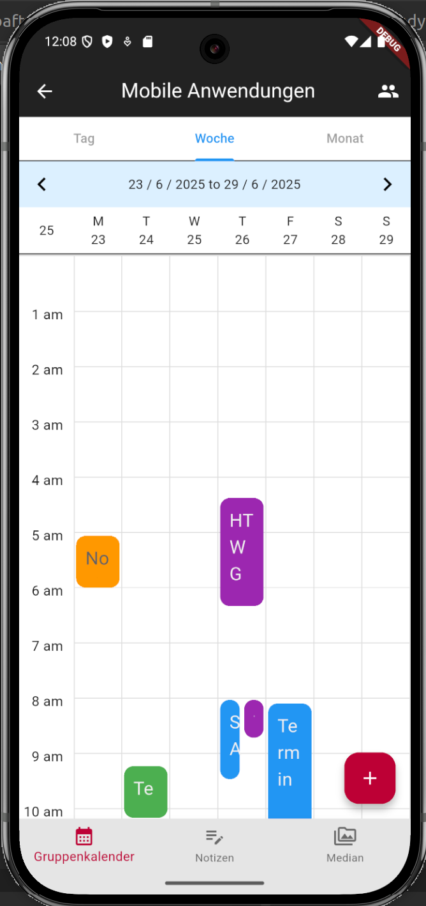

<p align="center">

</p>

# 📚 Konstudy  
[](https://flutter.dev)  
[](#)  
[](#)  
[](https://supabase.com)  

**Konstudy** is a mobile app built for students at **HTWG Konstanz** to simplify collaboration, communication, and time management.  

Create and join study groups, share notes, coordinate meetings through a shared calendar, and connect with fellow students—even ones you haven't met yet.

---

## 🧩 What Problem Does It Solve?

Students often find it difficult to organize study time effectively, especially in groups. Existing tools are fragmented — messaging apps, file-sharing tools, and separate calendars.

**Konstudy** brings everything into one place:
- 👥 Group creation and coordination  
- 📝 Shared note-taking  
- 📅 Integrated personal and group calendars  
- 📣 A public blackboard for discovering new study partners

---

## 🎯 Who Is It For?

**🎓 Persona: Tim, 20, Student at HTWG Konstanz**  

Tim is a 20-year-old student at HTWG Konstanz. Like many others at the university, he juggles multiple courses, projects, and part-time commitments. Coordinating study groups is often messy — spread across group chats, messaging apps, and email threads.

He’s looking for one place to:
- 👥 Create and manage study groups  
- 🗓️ Find common time slots to study with friends
- 📝 Collaborate on study material like notes
- 📌 Find new study partners with similar interests

**Konstudy** offers a centralized platform used by all HTWG students to collaborate more efficiently and discover new learning partners — all in one app.

---

## 🖼 Screens Overview

| Screen                  | Description                                                                                           |
|-------------------------|-------------------------------------------------------------------------------------------------------|
| 👥 **Group Overview Screen** | Displays a list of all your active study groups. Tap to view details or access shared content.           |
| 📅 **Personal Calendar Screen** | View your personal study schedule alongside events from all your joined groups.                           |
| 📣 **Black Board**             | A public board where students post requests to form new study groups — discover and join open groups.     |
| 📝 **Group Screen**            | Explore a single group’s shared notes. Collaborate and contribute in real time.                           |
| 📆 **Group Calendar Screen**   | View all group members' appointments to find common study slots and organize sessions efficiently.         |

---

## 📸 Screenshots

> 📌 Replace these placeholders with real screenshots when ready.

<div style="display: flex; gap: 5px;">
  
  
  
</div>

<br/>

<div style="display: flex; gap: 5px;">
  
  
</div>

---

## 🚀 Features

- 👥 **Create & Join Study Groups**  
  Organize study groups within the app and collaborate with other HTWG students.

- 🗓️ **Dual Calendar System**  
  - **Personal Calendar**: Combines your individual appointments and those from all your joined groups.  
  - **Group Calendar**: Displays every group member’s availability so you can find free spots to meet and study.

- 📝 **Shared Notes Within Groups**  
  Collaborate on group notes. Changes are synced once saved, enabling structured, ongoing contributions.

- 📣 **Black Board**  
  Browse and post public study group requests. Use your profile to connect with new students at HTWG Konstanz.

- 🔐 **Secure Email Login via Supabase**  
  Authentication handled through Supabase using email + password.

---

## 🏗 Architecture

**Konstudy** uses the **MVC+S (Model-View-Controller + Service)** architecture:

- **Model**: Defines core data such as users, events, and groups  
- **View**: The user interface built with Flutter widgets  
- **Controller**: Manages app flow, user interaction, and view logic  
- **Service**: Interfaces with Supabase for database and authentication

This modular structure ensures scalability, clarity, and testability.

---

## ⚙️ Tech Stack

### 🔧 Frontend
- **Flutter** 3.7.2+
- **Dart** (null safety enabled)
- **Riverpod** – state management
- **calendar_view** – interactive scheduling/calendar UI

### 🌐 Backend
- **Supabase**
  - Authentication (email + password)
  - Relational database

### 🗄 Storage
- All user and group data is stored remotely in **Supabase**.  
- No local persistence required.

---

## 🛠 Installation

You can either run the app locally or install it via APK.

### 📲 Option 1: Install APK
Download the `.apk` file from the master branch and install it on your Android device.

### 🧑‍💻 Option 2: Run Locally

#### 🔧 Prerequisites
- [Flutter SDK 3.7.2](https://flutter.dev/docs/get-started/install)
- Dart ≥ 3.0
- Android Studio or VS Code with Flutter plugin

#### 🚀 Steps

```bash
# 1. Clone the repository
git clone https://github.com/bafto/konstudy.git
cd konstudy

# 2. Install dependencies
flutter pub get

# 3. Run the app
flutter run
```

No environment setup is needed — Supabase credentials are already configured in the app.

### 👨‍💻 Developed By

@bafto
@Spankyhsk
